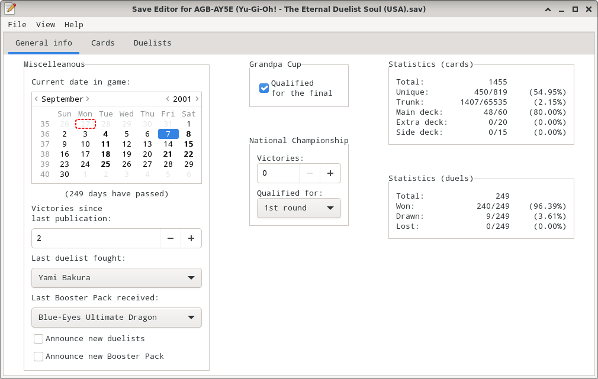
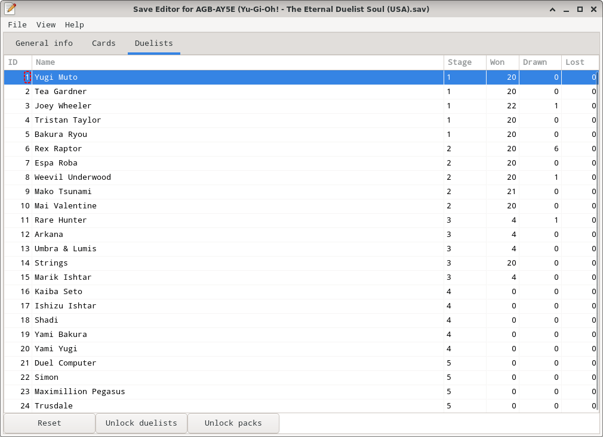

# Usage

## Introduction

This document explains how to use the savegame editor for the GameBoy Advance video game "Yu-Gi-Oh! - The Eternal Duelist Soul" (international edition) to create a new savegame from scratch or edit an existing one.

It also contains a [glossary](#glossary-and-basic-concepts) for novice players, as well as an [FAQ](#frequently-asked-questions) about specific subjects related to this video game.

## Interface Overview

The interface is divided into 3 parts:

1.  At the top, the menu bar gives access to some of the basic actions (see below)
2.  Right below the menu bar, a notebook with several tabs can be used to switch between the editor's various views
3.  The rest of the screen is used to display the selected view's content

Available menus:

*   `File` menu: create, load or save a savegame; exit the editor
*   `View` menu: switch between the views (same as clicking on the corresponding tab in the notebook)
*   `Help` menu: display this help file or display information about the editor

The following global keyboard shortcuts are also supported:

*   `Alt+F`: open/close the `File` menu
*   `Ctrl+N`: create a new savegame
*   `Ctrl+O`: load an existing savegame file
*   `Ctrl+R`: reload the currently-loaded savegame
*   `Ctrl+S`: save the current savegame
*   `Ctrl+Shift+S`: save the current savegame under a new name
*   `Ctrl+Q` or `Alt+F4`: quit the editor
*   `Alt+V`: open/close the `View` menu
*   `Alt+H`: open/close the `Help` menu
*   `F1`: display the help (this file)
*   `Alt+G`: go to the `General Information` view
*   `Alt+C`: go to the `Cards` view
*   `Alt+D`: go to the `Duelists` view
*   `Ctrl+PageUp` / `Ctrl+PageDown`: go to the previous/next view (circular)
*   `Shift+Tab` / `Tab`: give the focus to the previous/next field in the view
*   `Up` / `Down`: while in a menu, move to the previous/next menu entry
*   `Space` or `Enter`: while in a menu, activate the selected menu entry
*   `Escape`: while in a menu, close the menu

In addition, when the `About...` dialog (from the `Help` menu) is shown, either the `Escape` key or `Alt+F4` can be used to close the dialog.

If you try to create/load a new savegame or exit the editor while there are unsaved changes, a confirmation dialog will be shown:

The `Left` / `Right` arrow keys can be used to move between the `Cancel` and `OK` buttons (it is also possible to cycle between the two buttons using the `Tab` key).  
Pressing the `Enter` or `Space` key activates the focused button.  
Pressing the `Escape` key activates the `Cancel` button.

## Views

### General Information

This view allows various general values to be customized:

*   Current in-game date. The calendar also shows what in-game events are set to occur on each date (such as delivery of the Yu-Gi-Oh! Magazine, special matches, Ghouls encounter, etc.).
*   The number of duels won since the last publication of Weekly Yu-Gi-Oh! / Yu-Gi-Oh! Magazine and the last Booster Pack received.  
    When the number of victories is greater than 10, or greater than 6 and the Booster Pack in the next publication is different from the last one received,
    a Normal Rare, Secret Rare or Ultra Rare card is guaranteed to be included in the pack the player will receive.
*   The last duelist the player faced. This is used by the game to adapt some messages (to make it sound like a rematch if the player starts a new duel against the same opponent), but has no real impact on the overall game.
*   Whether some announcements will activate:
    * `Announce new duelists`: the next time the player goes to the game's `Campaign` menu, an announcement will be made about the availability of new duelists.
    * `Announce new Booster Pack`: the next time the player wins a duel, an announcement will be made about the availability of a new Booster Pack.

It also enables customization of values related to Grandpa's Cup and the National Championship:

*   Whether the player has qualified for the final round in the Grandpa Cup held in June.
*   The round the player has qualified for in the National Championship held in November.
*   How many times the player has won the National Championship (e.g. at least 2 victories are required to unlock Simon).

**Note:** the in-game date cannot be set to a value before January 1st, 2001, nor after June 6th, 2180.

The view also shows various statistics about the player's progress:

*   Statistics about the total number of cards obtained, how many unique cards have been collected, and so on.
*   Statistics about the total number of duels played, and how many duels have been won, drawn & lost.

The following keyboard shortcuts can also be used while on this view:

*   while focus is on the `Current date in the game` field:
    *   `Left` / `Right` arrow keys: move to the previous/next day
    *   `Ctrl+Left` / `Ctrl+Right`: move to the previous/next month
    *   `Up` / `Down` arrow keys: move to the previous/next week
    *   `Ctrl+Up` / `Ctrl+Down`: move to the previous/next year
    *   `Space`: if the currently focused day refers to a day in the previous/next month, move to that month. Otherwise, select the focused day

*   while focus is on a dropdown field (`Last duelist fought`, `Last pack received`, `Qualified for`):
    *   `Space` or `Enter`: if the dropdown is closed, open it (display the list of values). Otherwise, select the currently focus value
    *   `Up` / `Down` arrow keys: move the focus to the previous/next value in the list

*   while focus is on a checkbox field (`Announce new duelists`, `Announce new Boster Pack`, `Qualified for the final`):
    *   `Space` or `Enter`: toggle the checkbox's state (from unchecked to checkedand vice versa)

### Cards

This view can be used to:

*   View bits of information about a card present in the game.
*   Change the number of copies of a card inside the trunk, main deck/extra deck, or side deck.

**Note:** the editor applies the same limitations as the game. Therefore you may not have more than 3 copies of a card in your deck (including side deck).
In addition, some cards may be further limited. In some cases, a card may be completely forbidden and cannot be added to the main deck/extra deck or side deck at all.
The `Deck usage` column shows how many copies of a card are present in your main deck/extra deck and side deck (combined) and how many may be present at most.

In addition, several buttons at the bottom of the view can be used to edit the deck "en masse":

*   `Move all to trunk` moves every card currently in any of the decks to the trunk.
*   `New Deck (Black)`, `New Deck (Red)` & `New Deck (Green)` clear the trunk and deck, then create a brand new deck.
    The content of the new deck will be similar to that of the Black, Red and Green decks the player can choose from at the very beginning of the game, respectively.

The following keyboard shortcuts can also be used while on this view:

*   while focus is on the cards list:
    *   `Up` / `Down` arrow keys: move to the previous/next row in the list
    *   `PageUp` / `PageDown`: move to the previous/next page (in 10-entries increments) in the list
    *   `Home` / `End`: move to the beginning/end of the list
    *   `Space` or `Enter`:
        *   while a cell in the `ID`, `Name` or `Deck usage` columns is focused: display the card's information dialog (see below)
        *   while a cell in the `Trunk`, `Main/Extra deck` or `Side deck` columns is focused: edit the value
            (enter the new value, then press `Enter` to validate or `Escape` to cancel) 
        *   while a cell in the `Password used?` column is focused: toggle the checkbox between the checked/unchecked states
        *   has no effect otherwise
    *   any other key will start a (case-insensitive) search for cards whose name starts with the given text

*   while focus is on the search bar:
    *   `Enter` or `Escape`: close the search bar

*   while focus is on one of the buttons are the button of the screen:
    *   `Space` or `Enter`: activate the button

#### Card Information

This dialog is shown when a card's ID, name or deck usage is double clicked.

It display various pieces of information about the selected card, such as its type (Monster, Trap or Magic) and the in-game password required to unlock the card.
For monsters, additional data is shown such as the monster's level, attribute, type, ATK/DEF points and so on.

The following keyboard shortcuts can also be used while this dialog is shown:

*   `Escape` or `Alt+F4`: close the dialog (return to the card list)
*   `Up` / `Down` arrows keys: display information about the previous/next card in the list
*   `PageUp` / `PageDown`: move to the previous/next page in the card list and display information about the newly-selected card
*   `Home` / `End`: move to the beginning/end of the card list and display information about the first/last card

### Duelists

This view can be used to:

*   Edit how many duels have been won, drawn or lost to each of the game's duelist.

In addition, several buttons at the bottom of the view can be used to lock/unlock some features:

*   `Reset` sets the number of duels won, drawn & lost to 0 (zero) for every duelist.
*   `Unlock duelists` unlocks every duelist available in the game.
*   `Unlock packs` unlocks every Booster Pack available in the game.

**Note:** the `Reset` button also resets the list of duelists and packs available to the player (only those initially unlocked will be available).

The following keyboard shortcuts can also be used while on this view:

*   while focus is on the duelists list:
    *   `Up` / `Down`: move to the previous/next row in the list
    *   `PageUp` / `PageDown`: move to the previous/next page (in 10-entries increments) in the list
    *   `Home` / `End`: move to the beginning/end of the list
    *   `Space` or `Enter`:
        *   while a cell in the `Won`, `Drawn` or `Lost` columns is focused: edit the value
            (enter the new value, then press `Enter` to validate or `Escape` to cancel) 
        *   has no effect otherwise
    *   any other key will start a (case-insensitive) search for duelists whose name starts with the given text

*   while focus is on the search bar:
    *   `Enter` or `Escape`: close the search bar

*   while focus is on one of the buttons are the button of the screen:
    *   `Space` or `Enter`: activate the button

## Glossary and basic concepts

<dl>
<dt>Duelist</dt>
<dd>
Someone who plays the Yu-Gi-Oh! card game. Can be either a human player or a computer.
</dd>

<dt>Duel</dt>
<dd>
The name given to a fight between two duelists using the Yu-Gi-Oh! card game.
</dd>

<dt>Match</dt>
<dd>
A special type of game where two duelists fight in a best of three duels format.
</dd>

<dt>Trunk</dt>
<dd>
The list of cards the player has obtained through the game which are not currently in use by any of the decks.
It is possible for a card to appear in both the Trunk and in a deck at the same time if somes copies of the card are used and others are not.
</dd>

<dt>Main Deck</dt>
<dd>
The Main Deck represents the pile of cards that the player will be able to draw from during the game.
It must contain a minimum of 40 cards to be able to compete against other duelists and cannot contain more than 60 cards.
</dd>

<dt>Extra Deck</dt>
<dd>
The Extra Deck represents a pile of cards distinct from the Main Deck.
It contains cards that cannot be drawn but can nonetheless be played (by picking up the card directly from the Extra Deck) when specific requirements are met.
E.g. "Blue-Eyes Ultimate Dragon" can be Fusion Summoned from the Extra Deck when 3 copies of "Blue-Eyes White Dragon" are present on the player's field and the player activates the effect of "Polymerization".
The Extra Deck can contain up to 20 cards.
</dd>

<dt>Fusion Deck</dt>
<dd>
"Fusion Deck" is the former name for "Extra Deck". It was used back when the Extra Deck could only contain Fusion Monsters, as is the case in the game Yu-Gi-Oh! - The Eternal Duelist Soul.
It was later renamed when additional types of monsters were added to the card game (XYZ Monsters, Synchro Monsters, Link Monsters, etc.).
</dd>

<dt>Side Deck</dt>
<dd>
The Side Deck is used in matches, between duels, to alter the contents of the Main Deck/Extra Deck.
The Side Deck can contain up to 15 cards.
</dd>
</dl>

Please note that it is not possible to have more than 3 copies of a given card in your Main Deck, Extra Deck and Side Deck combined.
In addition, some cards may be further limited and some may be unplayable altogether (i.e. you cannot add a copy of that card to any of your decks).

## Frequently Asked Questions

### How many duelists are available in the game?

There are 24 duelists available in the game, grouped in 5 stages:

*   Stage 1:
    *   Tristan Taylor
    *   Tea Gardner
    *   Yugi Muto
    *   Joey Wheeler
    *   Bakura Ryou
*   Stage 2:
    *   Espa Roba
    *   Mako Tsunami
    *   Rex Raptor
    *   Weevil Underwood
*   Stage 3:
    *   Umbra & Lumis
    *   Arkana
    *   Rare Hunter
    *   Strings
    *   Marik Ishtar
*   Stage 4:
    *   Yami Bakura
    *   Ishizu Ishtar
    *   Seto Kaiba (misspelled as Kaiba Seto in the game)
    *   Shadi
    *   Yami Yugi
*   Stage 5:
    *   Maximillion Pegasus
    *   Simon (known as Simon Muran in the anime)
    *   Duel Computer
    *   Trusdale (known as Salomon Muto in the anime)

### How many cards are available in the game?

There are 820 cards in the game:

*   813 playables cards:
    *   148 Magic cards
    *   72 Trap cards
    *   381 Normal Monsters
    *   145 Effect Monsters
    *   52 Fusion Monsters
    *   15 Ritual Monsters
*   3 unplayable Tickets (`The Monarchy`, `Set Sail for the Kingdom` and `Glory of the King's Hand`)
*   3 unplayable Divine Monsters (`Obelisk the Tormenter`, `Slifer the Sky Dragon` and `The Winged Dragon of Ra`)
*   1 Monster Token (`Insect Monster Token`) -- this token will not appear in the trunk or in any deck, but will be played automatically when the right conditions are met (see the effect of `Insect Queen` for more information)

### How can I unlock the Nth stage?

To unlock the duelists present in the Nth stage, you must defeat every duelist in the previous stage N times.  
E.g. to unlock the 2nd stage, you must defeat every duelist in the 1st stage twice.

### How can I unlock Maximillion Pegasus?

Make sure you have the card "Toon World" in either your trunk, your main deck or your side deck.

### How can I unlock Simon?

Make sure you have won the National Championship held in November at least twice.

### How can I unlock Trusdale / Grandpa?

Make sure you have at least one copy of every card in either your trunk, your main deck or your side deck.  
**Due to a programming error in the game, this also includes the following unplayable cards:**

*   #814 - The Monarchy
*   #815 - Set Sail for the Kingdom
*   #816 - Glory of the King's Hand
*   #817 - Obelisk the Tormenter
*   #818 - Slifer the Sky Dragon
*   #819 - The Winged Dragon of Ra
*   #820 - Insect Monster Token

If you defeat Simon **the very first time you face him**, he will make sure you have at least one copy of every card in your trunk.
**Note:** Simon will not give you this reward if your first duel against him ended with your loss or a draw and you defeat him afterwards, sobe extra careful againt him.

Because `Insect Monster Token` cannot be obtained through Booster Packs, defeating Simon on your very fist encounter is the only way to get every card and unlock Trusdale legitimately.

